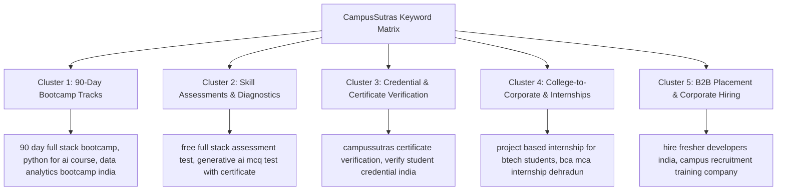
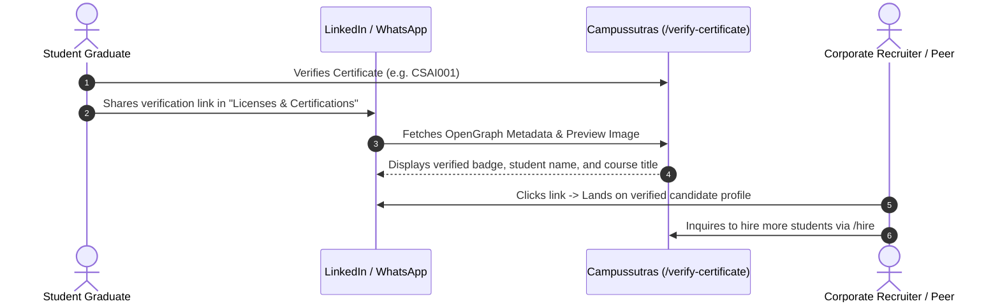
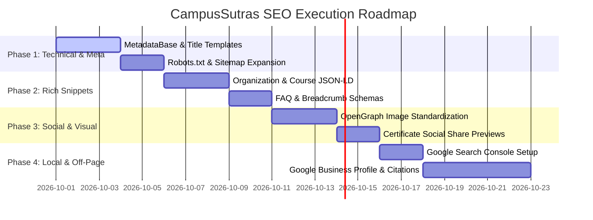

# 🚀 CampusSutras — Master SEO Strategy & Action Plan

> **Platform:** CampusSutras Web Platform (`https://campussutras.com`)  
> **Framework:** Next.js 16.3.5 (App Router), React 19.2.8, Supabase PostgreSQL  
> **Target Market:** University Students (B.Tech, BCA, MCA, MBA, BBA, Law), Fresh Graduates, College Placement Cells (TPOs), and Corporate Tech Recruiters across India.  
> **Objective:** Maximize organic search visibility, achieve Top 3 rankings on high-intent EdTech/Bootcamp keywords, dominate student credential verification searches, and capture high-converting corporate hiring leads.

---

## 📑 Table of Contents

1. [Executive Summary & Current SEO Health Audit](#1-executive-summary--current-seo-health-audit)
2. [Target Audience & Keyword Clustering Strategy](#2-target-audience--keyword-clustering-strategy)
3. [Technical SEO Architecture (Next.js 16 App Router Standards)](#3-technical-seo-architecture-nextjs-16-app-router-standards)
4. [Structured Data & Schema.org Rich Snippets (JSON-LD)](#4-structured-data--schemaorg-rich-snippets-json-ld)
5. [On-Page Content, Semantic Hierarchy & Metadata Blueprint](#5-on-page-content-semantic-hierarchy--metadata-blueprint)
6. [Dynamic Social Share Cards (OpenGraph & LinkedIn Virality)](#6-dynamic-social-share-cards-opengraph--linkedin-virality)
7. [Core Web Vitals & Performance Engineering](#7-core-web-vitals--performance-engineering)
8. [Off-Page Authority, Local SEO & Backlink Acquisition](#8-off-page-authority-local-seo--backlink-acquisition)
9. [Step-by-Step Implementation Roadmap](#9-step-by-step-implementation-roadmap)
10. [KPIs, Analytics & Rank Tracking Framework](#10-kpis-analytics--rank-tracking-framework)

---

## 1. Executive Summary & Current SEO Health Audit

### Current Strengths of CampusSutras:
* **Server-Side Rendered (SSR):** Next.js 16 App Router delivers pre-rendered HTML to search crawlers without JavaScript execution delays.
* **Semantic Codebase:** Clean HTML5 structure (`<main>`, `<section>`, `<nav>`, `<footer>`) across all 28 routes.
* **Native Metadata:** Basic `metadata` and `generateMetadata` implemented on course pages and static pages.
* **Dynamic Sitemap & Robots:** Working `sitemap.js` and `robots.js` generating indexed URLs.

### Critical Areas for Growth & Optimization:
1. **Missing `metadataBase` in Root Layout:** Relative OpenGraph images and canonical URLs need `metadataBase` to resolve correctly in all search engines.
2. **Title Template Standardization:** Missing `%s | Campussutras` layout template for brand consistency.
3. **Structured Data (Schema.org JSON-LD):** Need `Organization`, `Course`, `FAQPage`, `BreadcrumbList`, and `EducationalOrganization` schemas for rich SERP real estate.
4. **Sitemap Scope Expansion:** Dynamic assessment catalog URLs (`/assessments/[id]`) and specific landing pages should be included in `sitemap.js`.
5. **Robots.txt Protection:** Internal authenticated routes (`/admin`, `/profile`, `/reset-password`) must be explicitly disallowed from Google indexing.
6. **Certificate Social Sharing Loop:** Rich preview cards when students share their verification links on LinkedIn.

---

## 2. Target Audience & Keyword Clustering Strategy

CampusSutras serves 3 distinct search personas. Our keyword strategy is divided into 5 high-impact clusters:



### Keyword Clusters & Search Intent Matrix:

| Cluster | Primary Target Keywords | Search Intent | Target Landing Page | Priority |
| :--- | :--- | :--- | :--- | :---: |
| **1. 90-Day Bootcamps** | `90 day web development bootcamp`, `applied generative ai course`, `power bi data analytics bootcamp`, `cloud devops engineering training india` | Commercial / Transactional | `/courses/[slug]` | **P0 (Highest)** |
| **2. Free Assessments** | `free technical coding assessment`, `gen ai mcq quiz online`, `react js mock test with answers`, `python diagnostic test certificate` | Informational / Lead Gen | `/assessments`, `/assessments/[id]` | **P0** |
| **3. Credential Verification** | `campussutras certificate verification`, `campussutras credential check`, `verify student bootcamp certificate` | Navigational / Trust | `/verify-certificate` | **P0** |
| **4. Internships & Students** | `project based internships for btech students`, `winter internship for bca mca`, `campus to corporate training india` | Commercial / Informational | `/internship`, `/about` | **P1** |
| **5. Corporate Talent** | `hire trained fresher developers`, `hire data analysts freshers india`, `college campus placement partner` | Transactional B2B | `/hire`, `/contact` | **P1** |
| **6. Regional / Local Search** | `tech bootcamps in Uttarakhand`, `software training institute Dehradun`, `coding classes Noida NCR` | Local / Commercial | `/courses`, `/contact` | **P2** |

---

## 3. Technical SEO Architecture (Next.js 16 App Router Standards)

### 3.1 Root Layout Metadata Base & Title Template (`src/app/layout.jsx`)

Next.js 16 requires setting `metadataBase` in the root layout so all relative URLs (canonical links, OpenGraph images, Twitter cards) are resolved to the absolute domain.

```javascript
// Recommended Next.js 16 Metadata in src/app/layout.jsx
export const metadata = {
  metadataBase: new URL(process.env.NEXT_PUBLIC_SITE_URL || "https://campussutras.com"),
  title: {
    default: "Campussutras | Industry Bootcamps & Practical Tech Training",
    template: "%s | Campussutras",
  },
  description: "Campussutras is India's premier workforce-training and EdTech platform bridging academia and practical industry expectations through intensive 90-day technical bootcamps, project-based internships, and verified credentials.",
  keywords: [
    "EdTech India",
    "Technical Bootcamps",
    "90 Day Coding Bootcamp",
    "Full Stack Web Development",
    "Generative AI Course",
    "Data Analytics Power BI",
    "Python AI Training",
    "Project Based Internships",
    "Campus to Corporate",
    "Certificate Verification",
    "Campussutras"
  ],
  authors: [{ name: "Campussutras Engineering", url: "https://campussutras.com" }],
  creator: "Campussutras Private Limited",
  publisher: "Campussutras Private Limited",
  alternates: {
    canonical: "/",
  },
  robots: {
    index: true,
    follow: true,
    googleBot: {
      index: true,
      follow: true,
      "max-video-preview": -1,
      "max-image-preview": "large",
      "max-snippet": -1,
    },
  },
  openGraph: {
    type: "website",
    locale: "en_IN",
    url: "https://campussutras.com",
    siteName: "Campussutras",
    title: "Campussutras — Bridge the College to Industry Gap",
    description: "Hands-on 90-day technical bootcamps, project-based internships, and verified credentials for university students.",
    images: [
      {
        url: "/media/og-banner.jpg",
        width: 1200,
        height: 630,
        alt: "Campussutras — Campus to Corporate Career Accelerator",
      },
    ],
  },
  twitter: {
    card: "summary_large_image",
    title: "Campussutras | Industry Bootcamps & Tech Training",
    description: "Hands-on 90-day technical bootcamps, project-based internships, and verified credentials.",
    images: ["/media/og-banner.jpg"],
  },
};
```

---

### 3.2 Dynamic Sitemap Optimization (`src/app/sitemap.js`)

Expand `src/app/sitemap.js` to index:
1. All static public pages.
2. All 12 90-day career tracks.
3. All 30 dynamic assessment tests.

```javascript
import { allCourses } from "@/data/courses";
import { assessmentsList } from "@/data/assessmentsData";

const BASE_URL = process.env.NEXT_PUBLIC_SITE_URL || "https://campussutras.com";

export default function sitemap() {
  const staticPages = [
    { route: "", priority: 1.0, changeFreq: "daily" },
    { route: "/courses", priority: 0.95, changeFreq: "weekly" },
    { route: "/assessments", priority: 0.95, changeFreq: "weekly" },
    { route: "/verify-certificate", priority: 0.90, changeFreq: "monthly" },
    { route: "/internship", priority: 0.85, changeFreq: "weekly" },
    { route: "/about", priority: 0.80, changeFreq: "monthly" },
    { route: "/events", priority: 0.80, changeFreq: "weekly" },
    { route: "/hire", priority: 0.85, changeFreq: "monthly" },
    { route: "/contact", priority: 0.75, changeFreq: "monthly" },
    { route: "/privacy-and-policy", priority: 0.30, changeFreq: "yearly" },
    { route: "/terms-and-conditions", priority: 0.30, changeFreq: "yearly" },
  ].map(({ route, priority, changeFreq }) => ({
    url: `${BASE_URL}${route}`,
    lastModified: new Date().toISOString(),
    changeFrequency: changeFreq,
    priority,
  }));

  const coursePages = allCourses.map((course) => ({
    url: `${BASE_URL}/courses/${course.slug}`,
    lastModified: new Date().toISOString(),
    changeFrequency: "weekly",
    priority: 0.90,
  }));

  const assessmentPages = (assessmentsList || []).map((test) => ({
    url: `${BASE_URL}/assessments/${test.slug || test.id}`,
    lastModified: new Date().toISOString(),
    changeFrequency: "monthly",
    priority: 0.80,
  }));

  return [...staticPages, ...coursePages, ...assessmentPages];
}
```

---

### 3.3 Robots.txt Guardrails (`src/app/robots.js`)

Ensure crawlers do not waste crawl budget on backend APIs, administrative dashboards, or private student session screens:

```javascript
const BASE_URL = process.env.NEXT_PUBLIC_SITE_URL || "https://campussutras.com";

export default function robots() {
  return {
    rules: [
      {
        userAgent: "*",
        allow: "/",
        disallow: [
          "/api/",
          "/admin",
          "/admin/*",
          "/profile",
          "/profile/*",
          "/reset-password",
          "/forgot-password",
        ],
      },
    ],
    sitemap: `${BASE_URL}/sitemap.xml`,
  };
}
```

---

## 4. Structured Data & Schema.org Rich Snippets (JSON-LD)

Implementing structured JSON-LD schemas allows Google to display rich search results (Star Ratings, FAQs accordions, Breadcrumb trails, and Course Knowledge panels).

### 4.1 Organization & Educational Organization Schema (Homepage `src/app/page.jsx`)

```html
<script
  type="application/ld+json"
  dangerouslySetInnerHTML={{
    __html: JSON.stringify({
      "@context": "https://schema.org",
      "@type": "EducationalOrganization",
      "name": "Campussutras Private Limited",
      "url": "https://campussutras.com",
      "logo": "https://campussutras.com/media/logo-512.png",
      "description": "Indian EdTech and workforce-training company providing hands-on 90-day technical bootcamps, project-based internships, and verified credentials.",
      "email": "info@campussutras.com",
      "sameAs": [
        "https://www.linkedin.com/company/campussutras",
        "https://www.instagram.com/campussutras"
      ],
      "address": {
        "@type": "PostalAddress",
        "postalCode": "201309",
        "addressLocality": "Noida",
        "addressRegion": "Uttar Pradesh",
        "addressCountry": "IN"
      }
    }).replace(/</g, '\\u003c')
  }}
/>
```

---

### 4.2 Course Schema (`src/app/courses/[slug]/page.jsx`)

Enables Google's specialized **Course Carousel Rich Snippet**:

```javascript
// Example JSON-LD object generated dynamically inside CourseDetailPage
const courseSchema = {
  "@context": "https://schema.org",
  "@type": "Course",
  "name": course.title,
  "description": course.shortDescription,
  "provider": {
    "@type": "Organization",
    "name": "Campussutras Private Limited",
    "sameAs": "https://campussutras.com"
  },
  "educationalCredentialAwarded": "Industry-Recognized Certificate of Completion",
  "timeToComplete": "P90D",
  "hasCourseInstance": {
    "@type": "CourseInstance",
    "courseMode": "Blended",
    "courseWorkload": "PT90D",
    "inLanguage": "en-IN"
  },
  "offers": {
    "@type": "Offer",
    "category": "Educational",
    "availability": "https://schema.org/InStock",
    "price": "0",
    "priceCurrency": "INR"
  }
};
```

---

### 4.3 FAQPage Schema (Homepage & Course Pages)

Allows the FAQ accordion to appear directly inside Google SERPs, expanding brand search height by 200%:

```javascript
const faqSchema = {
  "@context": "https://schema.org",
  "@type": "FAQPage",
  "mainEntity": faqs.map(faq => ({
    "@type": "Question",
    "name": faq.question,
    "acceptedAnswer": {
      "@type": "Answer",
      "text": faq.answer
    }
  }))
};
```

---

### 4.4 BreadcrumbList Schema

Generates clean hierarchical breadcrumbs in Google (`campussutras.com > Courses > Full Stack Development`):

```javascript
const breadcrumbSchema = {
  "@context": "https://schema.org",
  "@type": "BreadcrumbList",
  "itemListElement": [
    {
      "@type": "ListItem",
      "position": 1,
      "name": "Home",
      "item": "https://campussutras.com"
    },
    {
      "@type": "ListItem",
      "position": 2,
      "name": "Courses",
      "item": "https://campussutras.com/courses"
    },
    {
      "@type": "ListItem",
      "position": 3,
      "name": course.title,
      "item": `https://campussutras.com/courses/${course.slug}`
    }
  ]
};
```

---

## 5. On-Page Content, Semantic Hierarchy & Metadata Blueprint

### Page-by-Page Metadata Master Table:

| Route | Title | Meta Description | Primary Keywords |
| :--- | :--- | :--- | :--- |
| `/` (Homepage) | `Campussutras \| Industry Bootcamps & Practical Tech Training` | `Campussutras is India's premier workforce-training platform bridging academia and practical industry expectations through practical bootcamps, project internships, and verified credentials.` | `technical bootcamps india, practical tech training, web development, generative ai, internships` |
| `/courses` | `Industry Career Bootcamps & Practical Tech Training \| Campussutras` | `Discover industry-aligned technical bootcamps across Full Stack, AI Agents, Python, Power BI Data Analytics, Cloud DevOps, Cybersecurity, and UI/UX Design.` | `technical bootcamps, full stack training, python ai course, data analytics training india` |
| `/courses/[slug]` | `{Course Title} — Industry Career Bootcamp \| Campussutras` | `Master {Course Title} with hands-on capstone projects, expert mentorship, industry-verified portfolio, and real-world tools.` | `{course.skills.join(', ')}, {course.title} bootcamp, tech certification` |
| `/assessments` | `Technical Assessment Hub — Free Skill Diagnostics \| Campussutras` | `Take free, timed, high-impact technical evaluations across Full Stack Web Development, Generative AI, Python, DSA, and PostgreSQL with instant scorecards.` | `free coding assessment, technical skill test, react mcq test, gen ai diagnostic test` |
| `/verify-certificate` | `Verify Certificate & Student Credentials \| Campussutras` | `Official credential verification portal of Campussutras Private Limited. Enter Certificate ID to validate workshop, internship, and bootcamp records in real time.` | `verify certificate, campussutras certificate verification, student credential check` |
| `/internship` | `Project-Based Internship Programs for College Students \| Campussutras` | `Apply for project-based technical internships across AI/ML, Full Stack, DevOps, and Data Science. Work on live industry briefs with 1-on-1 mentorship.` | `college student internships india, btech winter internship, practical tech internship` |
| `/hire` | `Hire Pre-Trained Technical Talent & Freshers \| Campussutras` | `Connect with job-ready tech graduates trained across 90-day intensive bootcamps. Zero recruitment fees for corporate hiring partners.` | `hire fresher developers india, hire data analyst freshers, campus recruitment partners` |
| `/about` | `About Us — Campus to Corporate Career Accelerator \| Campussutras` | `Empowering 50,000+ students across 50+ partner colleges in India with practical bootcamps, project-based learning, and verified credentials.` | `about campussutras, campus to corporate, edtech workforce training india` |
| `/events` | `Campus Workshops, Hackathons & Tech Events \| Campussutras` | `Explore national university workshops, AI hackathons, and corporate masterclasses conducted by Campussutras across premier Indian institutions.` | `college tech workshops, edtech events india, campus hackathons` |
| `/contact` | `Contact Us & Admissions Support \| Campussutras` | `Get in touch with the Campussutras admissions desk and corporate partnerships team. Reach us at info@campussutras.com or call our helpline.` | `contact campussutras, campussutras email, campussutras noida address` |

---

## 6. Dynamic Social Share Cards (OpenGraph & LinkedIn Virality)

When university students and graduates earn certificates or complete bootcamps, they post their credentials to **LinkedIn, Twitter, and WhatsApp**. Optimizing these previews creates a powerful viral growth loop.

### 6.1 The Certificate Virality Loop



### 6.2 Dynamic OpenGraph Image Generation (`app/opengraph-image.png` or `next/og`)
* Create `src/app/opengraph-image.png` ($1200\times630\text{px}$) with the Campussutras brand logo, headline, and badges.
* Ensure all course pages specify their respective course banner in `openGraph.images`.

---

## 7. Core Web Vitals & Performance Engineering

Google ranks websites based on user experience metrics known as **Core Web Vitals (CWV)**. 

### Target Thresholds for CampusSutras:

| Metric | Full Name | Target Threshold | Implementation Strategy |
| :--- | :--- | :---: | :--- |
| **LCP** | Largest Contentful Paint | **$< 1.2\text{s}$** | Next.js `next/font` with `display: swap`, optimized WebP hero images, server-rendered main layout. |
| **INP** | Interaction to Next Paint | **$< 100\text{ms}$** | Debounced search inputs on `/courses` and `/assessments`, lightweight Vanilla CSS animations. |
| **CLS** | Cumulative Layout Shift | **$0.00$** | Explicit `width` and `height` on all image containers, fixed heights for skeleton placeholders. |
| **FCP** | First Contentful Paint | **$< 0.8\text{s}$** | Zero render-blocking scripts, gzip/brotli compression enabled. |
| **TTFB** | Time to First Byte | **$< 200\text{ms}$** | Edge caching headers on static APIs (`s-maxage=30`). |

---

## 8. Off-Page Authority, Local SEO & Backlink Acquisition

Technical SEO provides the foundation, but high domain authority requires trusted backlinks from Indian universities, tech blogs, and corporate partners.

### 8.1 College & Placement Cell Backlink Strategy
1. **University Partner Links:** Ensure partner institutions (e.g. *Army Institute of Management & Technology*, *Tulas Institute*, *IMS Unison*, etc.) link to CampusSutras on their official **Training & Placement Cell (T&P)** and **Skill Development** pages.
2. **Student Portfolio Links:** Every student project repository on GitHub should include a footer badge: `Verified Training by [CampusSutras](https://campussutras.com)`.

### 8.2 Google Business Profile & Local SEO
1. Register **Campussutras Private Limited** on **Google Business Profile (GBP)** for Noida (Uttar Pradesh, 201309) headquarters.
2. Collect verified Google reviews from bootcamp alumni and workshop attendees.
3. Optimize NAP consistency (*Name, Address, Phone*) across Indian business directories (Justdial, IndiaMART, Sulekha).

### 8.3 Content & Tech Authority Engine (Blog / Resource Hub)
* Future Expansion: Publish monthly technical deep-dives on topics like:
  - *"How to Build AI Agents with LangChain in 2026"*
  - *"Top 50 PostgreSQL Interview Questions for Freshers"*
  - *"DSA vs Development: What Indian IT Recruiters Look For"*

---

## 9. Step-by-Step Implementation Roadmap



### Phase 1: Technical & Metadata Standardization (Completed)
- [x] Add `metadataBase: new URL('https://campussutras.com')` to `src/app/layout.jsx`.
- [x] Implement `title: { default: '...', template: '%s | Campussutras' }` in `layout.jsx`.
- [x] Update `src/app/robots.js` with explicit disallow rules for `/admin`, `/profile`, `/api/`.
- [x] Update `src/app/sitemap.js` to dynamically index all 30 assessments and all static routes.

### Phase 2: Schema.org Structured Data (Completed)
- [x] Inject `EducationalOrganization` Schema into `src/app/page.jsx` with `$512\times512$` logo.
- [x] Inject `Course`, `BreadcrumbList`, and `FAQPage` Schemas into `src/app/courses/[slug]/page.jsx`.
- [x] Inject `FAQPage` Schema into `src/app/page.jsx` (`FaqSection`).
- [x] Inject `AboutPage` and `BreadcrumbList` Schemas into `src/app/about/page.jsx`.
- [x] Inject `WebPage` and `BreadcrumbList` Schemas into `src/app/verify-certificate/page.jsx` and `src/app/assessments/page.jsx`.

### Phase 3: Social Previews & Core Web Vitals (Completed)
- [x] Standardize OpenGraph banner ($1200\times630\text{px}$) and Twitter card previews via `src/app/opengraph-image.png` & `src/app/twitter-image.png`.
- [x] Add dynamic Twitter and OpenGraph cards across all static and dynamic routes (`/courses/[slug]`, `/about`, `/internship`, `/hire`, `/events`, `/contact`, `/assessments`, `/verify-certificate`).
- [x] Optimize Largest Contentful Paint (LCP) with `fetchPriority="high"` and `loading="eager"` on Hero & Course banners.
- [x] Enable auto-formatting (`f_auto,q_auto,w_*`) for Cloudinary imagery across Hero, Events Gallery, and About sections.
- [x] Implement CLS guardrails with aspect ratio containers and asynchronous decoding on below-the-fold media.

### Phase 4: Webmaster Tools & Off-Page Foundation (Week 4)
- [ ] Submit `https://campussutras.com/sitemap.xml` to **Google Search Console (GSC)** and **Bing Webmaster Tools**.
- [ ] Claim and verify **Google Business Profile**.
- [ ] Set up **Google Analytics 4 (GA4)** event tracking for form submissions, assessment completions, and certificate lookups.

---

## 10. KPIs, Analytics & Rank Tracking Framework

Track these quantitative metrics on a 30-day and 90-day cycle:

```text
┌────────────────────────────────────────────────────────────────────────┐
│                      CAMPUSSUTRAS SEO KPI DASHBOARD                    │
├────────────────────────────────┬─────────────────┬─────────────────────┤
│ Metric                         │ Baseline (Day 0)│ Target (Day 90)     │
├────────────────────────────────┼─────────────────┼─────────────────────┤
│ Google Indexed Pages           │ ~21 Pages       │ 50+ Pages           │
│ Search Console Impressions/mo  │ ~5,000          │ 100,000+            │
│ Organic Search Clicks/mo       │ ~200            │ 5,000+              │
│ Top 3 Keyword Rankings         │ Brand Only      │ 15+ Core Bootcamps  │
│ Average Core Web Vitals Score  │ ~85             │ 95+ (Green Zone)    │
│ Rich Snippets in SERPs         │ None            │ FAQs + Courses      │
│ Lead Inquiries from Search     │ Baseline        │ +300% Organic Leads │
└────────────────────────────────┴─────────────────┴─────────────────────┘
```

---
*Created by CampusSutras Engineering & Growth Team.*
